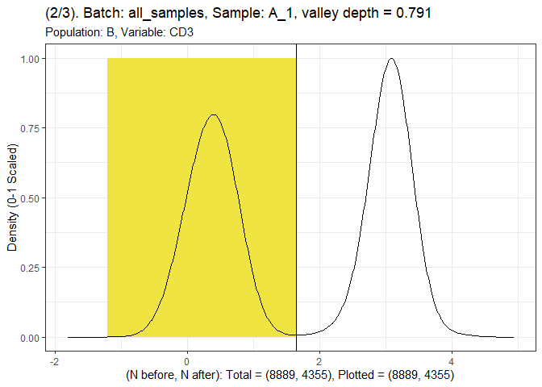
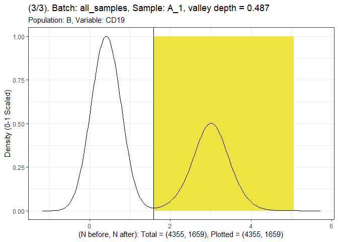
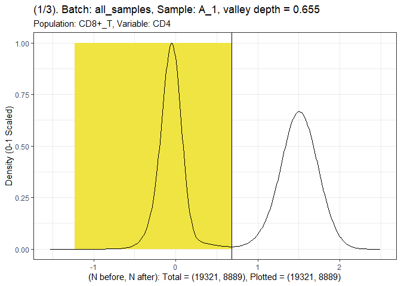
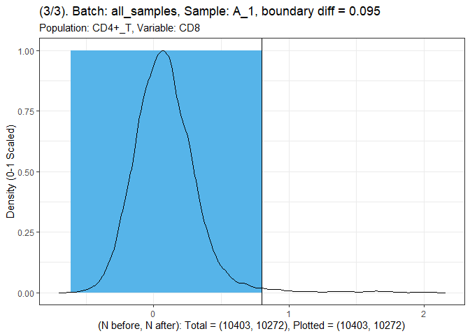
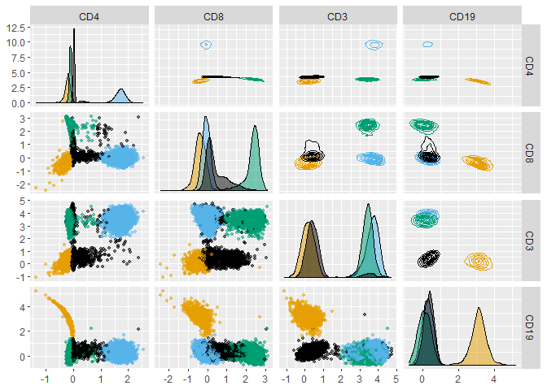

gateTree2
================
Ultán P. Doherty
2025-07-22

## Install `gateTree2`.

``` r
remotes::install_github("UltanPDoherty/gateTree2")
```

## Load and plot data from the `healthyFlowData` package.

``` r
data(hd, package = "healthyFlowData")
hfd_exprs <- lapply(hd.flowSet@frames, \(x) x@exprs)

GGally::ggpairs(
  hfd_exprs[[1]],
  upper = list(continuous = "density"),
  lower = list(continuous = GGally::wrap("points", alpha = 0.5, size = 1)),
  progress = FALSE
)
```

<!-- -->

## Prepare a plusminus table which describes three populations.

- CD4+ T Cells (CD4+CD8-CD3+CD19-)
- CD8+ T Cells (CD4-CD8+CD3+CD19-)
- B Cells (CD4-CD8-CD3-CD19+)

``` r
plusminus1 <- as.data.frame(rbind(
  "CD4+_T" = c(+1, -1, +1, -1),
  "CD8+_T" = c(-1, +1, +1, -1),
  "B"      = c(-1, -1, -1, +1)
))
colnames(plusminus1) <- colnames(hfd_exprs[[1]])
plusminus1
```

    ##        CD4 CD8 CD3 CD19
    ## CD4+_T   1  -1   1   -1
    ## CD8+_T  -1   1   1   -1
    ## B       -1  -1  -1    1

## Excel can be used to save or create tables (`openxlsx` package).

``` r
openxlsx::write.xlsx(
  plusminus1,
  "~/plusminus.xlsx",
  rowNames = TRUE,
  colNames = TRUE
)

plusminus2 <- openxlsx::read.xlsx(
  "~/plusminus.xlsx",
  rowNames = TRUE,
  colNames = TRUE
)
```

## Apply `gateTree` to all 20 samples.

``` r
hfd_gatetree <- gateTree2::gatetree(
  list("all_samples" = hfd_exprs),
  as.matrix(plusminus2),
  min_depth = 0.05,
  min_diff = 0.05
)

hfd_gatetree_labels <- gateTree2::extract_labels(hfd_gatetree)
```

## Plot the tree diagram.

``` r
gateTree2::plot_tree(hfd_gatetree)
```

<!-- -->

## Plot the splits for Sample A_1.

``` r
gateTree2::plot_split(
  list("all_samples" = hfd_exprs),
  hfd_gatetree,
  batch = 1, samp = "A_1", pop = "B"
)
```

    ## [[1]]

<!-- -->

    ## 
    ## [[2]]

<!-- -->

    ## 
    ## [[3]]

<!-- -->

``` r
gateTree2::plot_split(
  list("all_samples" = hfd_exprs),
  hfd_gatetree,
  batch = 1, samp = "A_1", pop = "CD8+_T"
)
```

    ## [[1]]

<!-- -->

    ## 
    ## [[2]]

<!-- -->

    ## 
    ## [[3]]

<!-- -->

``` r
gateTree2::plot_split(
  list("all_samples" = hfd_exprs),
  hfd_gatetree,
  batch = 1, samp = "A_1", pop = "CD4+_T"
)
```

    ## [[1]]

<!-- -->

    ## 
    ## [[2]]

<!-- -->

    ## 
    ## [[3]]

<!-- -->

## Plot Sample A_1, coloured according to the `gateTree` labels.

``` r
GGally::ggpairs(
  hfd_exprs$A_1,
  upper = list(continuous = "density"),
  lower = list(continuous = GGally::wrap("points", alpha = 0.5, size = 1)),
  diag = list(continuous = GGally::wrap("densityDiag", alpha = 0.5)),
  mapping = ggplot2::aes(colour = hfd_gatetree_labels$all_samples$A_1),
  progress = FALSE
) +
  ggokabeito::scale_colour_okabe_ito(order = c(1, 2, 3, 9)) +
  ggokabeito::scale_fill_okabe_ito(order = c(1, 2, 3, 9))
```

<!-- -->

## Plot Sample D_5, coloured according to the `gateTree` labels.

``` r
GGally::ggpairs(
  hfd_exprs$D_5,
  upper = list(continuous = "density"),
  lower = list(continuous = GGally::wrap("points", alpha = 0.5, size = 1)),
  diag = list(continuous = GGally::wrap("densityDiag", alpha = 0.5)),
  mapping = ggplot2::aes(colour = hfd_gatetree_labels$all_samples$D_5),
  progress = FALSE
) +
  ggokabeito::scale_colour_okabe_ito(order = c(1, 2, 3, 9)) +
  ggokabeito::scale_fill_okabe_ito(order = c(1, 2, 3, 9))
```

<!-- -->
