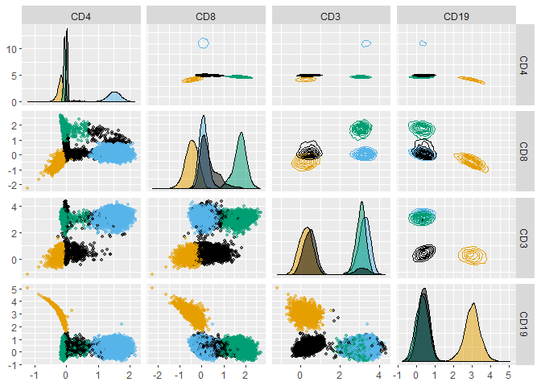

gateTree
================
Ultán P. Doherty
2024-04-25

## Install and load `gateTree`.

``` r
remotes::install_github("UltanPDoherty/gateTree")
```

``` r
library(gateTree)
```

## Load and plot data from `healthyFlowData`.

``` r
library(healthyFlowData)
data(hd)
hfd1 <- hd.flowSet[[1]]@exprs

GGally::ggpairs(hfd1, upper = list(continuous = "density"), progress = FALSE)
```

<!-- -->

## Prepare a plusminus table which describes three populations.

- CD4+ T Cells (CD4+CD8-CD3+CD19-)
- CD8+ T Cells (CD4-CD8+CD3+CD19-)
- B Cells (CD4-CD8-CD3-CD19+)

``` r
plusminus1 <- as.data.frame(rbind(
  "CD4+_T" = c(+1, -1, +1, -1),
  "CD8+_T" = c(-1, +1, +1, -1),
  "B"      = c(-1, -1, -1, +1)
))
colnames(plusminus1) <- colnames(hfd1)
plusminus1
```

    ##        CD4 CD8 CD3 CD19
    ## CD4+_T   1  -1   1   -1
    ## CD8+_T  -1   1   1   -1
    ## B       -1  -1  -1    1

## This plusminus table can be saved as an Excel file.

``` r
openxlsx::write.xlsx(plusminus1, "~/plusminus.xlsx",
                     rowNames = TRUE, colNames = TRUE)
```

## plusminus tables can also be created in Excel, then read into R.

``` r
plusminus2 <- openxlsx::read.xlsx("~/plusminus.xlsx",
                                  rowNames = TRUE, colNames = TRUE)
```

## Run the `gatetree` function.

``` r
hfd1_gatetree <- gatetree(hfd1, plusminus2,
  min_scaled_bic_diff = 50,
  min_depth = 10,
  show_plot = c(TRUE, FALSE)
)
```

<!-- --><!-- --><!-- -->

## Plot the tree diagram.

``` r
hfd1_gatetree$tree_plot +
  ggplot2::scale_y_continuous(expand = c(0.1, 0.1)) +
  ggplot2::scale_x_continuous(expand = c(0.1, 0.1))
```

<!-- -->

## Plot the data, coloured according to the `gateTree` labels.

``` r
GGally::ggpairs(hfd1,
  progress = FALSE,
  upper = list(continuous = "density"),
  ggplot2::aes(colour = as.factor(1 + hfd1_gatetree$labels))
) +
  ggokabeito::scale_colour_okabe_ito(order = c(9, 1, 2, 3)) +
  ggokabeito::scale_fill_okabe_ito(order = c(9, 1, 2, 3))
```

<!-- -->
